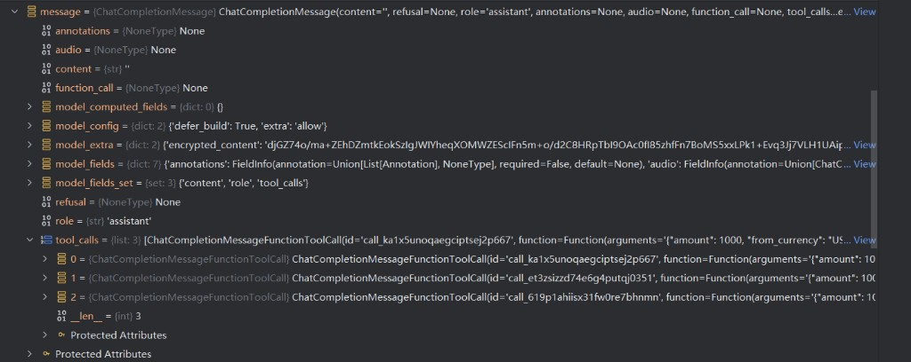

# Currency Conversion Demo

从 `week1/context` 抽取的**独立精简工程**，直接运行货币换算示例（Sample 1），无需交互式输入。

## 任务

将 $1000 USD 转换为 EUR、GBP、JPY，并计算三者换算结果的平均值。

## 运行

```bash
cd week1/currency-conversion
pip install -r requirements.txt
cp env.example .env   # 填入 ARK_API_KEY 等
python main.py
```

所有配置在 `.env` 中设置（`ARK_API_KEY`、`MODEL_NAME`），见 `env.example`。

## 豆包 API 地址说明

火山方舟文档中的 Chat API 完整地址为：

```text
https://ark.cn-beijing.volces.com/api/v3/chat/completions
```

本工程使用 OpenAI 兼容 SDK（`openai` 包），`agent.py` 中配置的是 **API 根路径** `base_url`，而不是完整 endpoint：

```python
OpenAI(
    api_key=api_key,
    base_url="https://ark.cn-beijing.volces.com/api/v3",  # 不含 /chat/completions
)
```

调用 `client.chat.completions.create(...)` 时，SDK 会自动拼接路径：

```text
base_url + /chat/completions
= https://ark.cn-beijing.volces.com/api/v3/chat/completions
```

因此 `base_url` 与文档中的完整 URL **并不矛盾**，写法是正确的。

常见误配：

| 写法 | 结果 |
|------|------|
| `base_url=".../api/v3"` + `chat.completions.create()` | 正确 |
| `base_url=".../api/v3/chat/completions"` | 错误，SDK 会再拼 `/chat/completions`，导致 404 |
| `base_url="https://ark.cn-beijing.volces.com"` | 错误，缺少 `/api/v3` 前缀 |

## Chat API 请求与响应

本工程使用 **Chat Completions API**（`client.chat.completions.create`），每轮 Agent 循环都会发起一次 HTTP 请求。

### 请求参数

`agent.py` 中每次调用传入的参数如下：

| 参数 | 本工程取值 | 说明 |
|------|-----------|------|
| `model` | `.env` 中的 `MODEL_NAME` | 模型 ID，如 `doubao-seed-2-0-lite-260428` |
| `messages` | 累积的对话历史数组 | 含 system、user、assistant、tool 等角色消息 |
| `tools` | `TOOLS_SCHEMA` | 可用工具定义（`convert_currency`、`calculate`） |
| `tool_choice` | `"auto"` | 由模型自行决定是否调用工具 |
| `temperature` | `0.3` | 采样温度，越低输出越稳定 |
| `max_tokens` | `8192` | 单次回复最大 token 数 |
| `timeout` | `180` | 请求超时（秒） |

货币换算任务通常需要 **3 轮** Chat API 调用（3 次 iteration），`messages` 会随工具调用结果不断增长。

### 响应结构（首轮示例）

首轮响应中，模型选择并行调用 3 次 `convert_currency`，典型字段如下：

| 字段 | 含义 |
|------|------|
| `id` | 本次 completion 的唯一 ID |
| `choices[0].finish_reason` | `"tool_calls"` 表示模型要调用工具，而非直接给最终文本 |
| `choices[0].message.tool_calls` | 工具调用列表（可一次返回多个） |
| `choices[0].message.content` | 面向用户的可见回复（调用工具时可能为空字符串） |
| `model` | 实际使用的模型 |
| `usage.prompt_tokens` / `completion_tokens` | token 用量统计 |

### 首轮完整响应 JSON（Iteration 1）

以下为实际运行中 **第 1 轮** API 返回的完整响应（`agent.py` 通过 `response.model_dump()` 打印）。此时 `finish_reason` 为 `tool_calls`，模型并行发起 3 次 `convert_currency`：

```json
{
  "id": "0217822635062641e8917f6489049782b636a98f4bd750c43d81f",
  "choices": [
    {
      "finish_reason": "tool_calls",
      "index": 0,
      "logprobs": null,
      "message": {
        "content": "",
        "refusal": null,
        "role": "assistant",
        "annotations": null,
        "audio": null,
        "function_call": null,
        "tool_calls": [
          {
            "id": "call_ka1x5unoqaegciptsej2p667",
            "function": {
              "arguments": "{\"amount\": 1000, \"from_currency\": \"USD\", \"to_currency\": \"EUR\"}",
              "name": "convert_currency"
            },
            "type": "function"
          },
          {
            "id": "call_et3zsizzd74e6g4putqj0351",
            "function": {
              "arguments": "{\"amount\": 1000, \"from_currency\": \"USD\", \"to_currency\": \"GBP\"}",
              "name": "convert_currency"
            },
            "type": "function"
          },
          {
            "id": "call_619p1ahiisx31fw0re7bhnmn",
            "function": {
              "arguments": "{\"amount\": 1000, \"from_currency\": \"USD\", \"to_currency\": \"JPY\"}",
              "name": "convert_currency"
            },
            "type": "function"
          }
        ],
        "reasoning_content": "I will handle the currency conversion of 1000 USD to EUR, GBP and JPY.I will first complete three currency conversion calls to get the equivalent values of 1000 USD in EUR, GBP and JPY, then calculate their average using the relevant calculation function.\n",
        "encrypted_content": "djGZ74o/ma+ZEhDZmtk...（已截断）"
      }
    }
  ],
  "created": 1782263514,
  "model": "doubao-seed-2-0-lite-260428",
  "object": "chat.completion",
  "usage": {
    "completion_tokens": 412,
    "prompt_tokens": 617,
    "total_tokens": 1029,
    "completion_tokens_details": {
      "reasoning_tokens": 233
    }
  }
}
```

要点：

- `message.content` 为空字符串，真正动作在 `tool_calls` 里
- `tool_calls` 一次返回 3 个对象，分别换算 USD → EUR / GBP / JPY
- `reasoning_content`、`encrypted_content` 为豆包扩展字段（见「PyCharm 调试」一节）

### 第二轮完整响应 JSON（Iteration 2）

以下为 **第 2 轮** API 返回的完整响应。此时 `messages` 已包含第 1 轮的 3 条 `tool` 结果，模型根据换算值调用 `calculate` 计算平均值：

```json
{
  "id": "021782265761034cbbef0300aace80be9f76027bd9c819d3e9dfe",
  "choices": [
    {
      "finish_reason": "tool_calls",
      "index": 0,
      "logprobs": null,
      "message": {
        "content": "",
        "refusal": null,
        "role": "assistant",
        "annotations": null,
        "audio": null,
        "function_call": null,
        "tool_calls": [
          {
            "id": "call_c45osor3rgoig8nwbwpbclfg",
            "function": {
              "arguments": "{\"expression\": \"(920 + 790 + 149500)/3\"}",
              "name": "calculate"
            },
            "type": "function"
          }
        ],
        "reasoning_content": "The three converted currency values have already been obtained, and the next step is to calculate their average.The calculation expression has been confirmed, and the calculation tool will be called next to get the average result.\n",
        "encrypted_content": "djHR7S9JP5cZTsJQiOVd7vPeeKZqneKqZzvkqExaWuhzu0QUlI5qsGhm8ShtDM4Q/SlQ1K/ri3ye8Mz4XR0maQl+CZqoXCE8gPfWhmWRfX0lAq5muzbGKN0N6kc6BrKOlEII+/TjJOLYc2bkiF73biwHQmauC+BQgGhWOzIktxkPlW8swPCegKNhZBe13YTSoD5forJkhwlh4xZoi1t6BZJQ1/RfniiZaEg+m3FXzqZ2bnHZWjkl6OTzbc0/y7iKH3md0lT9TOqqsCHYH/pcQZVA9KVP14pMyZih6HfoCtwXMOmz+49lAwkkMWrW2/JuspdC63lOySH6KwZrlhh9CaSN4EDZE77JZs1olo+jP/lL+wAf48Qdd3QRYDYiOCPcGz2bh7F1GSMlLF1LcrPIBFAwpfcjm44wjz+tj1I29eAemAxE8MleRrEd01ja"
      }
    }
  ],
  "created": 1782265766,
  "model": "doubao-seed-2-0-lite-260428",
  "object": "chat.completion",
  "moderation": null,
  "service_tier": "default",
  "system_fingerprint": null,
  "usage": {
    "completion_tokens": 174,
    "prompt_tokens": 1290,
    "total_tokens": 1464,
    "completion_tokens_details": {
      "accepted_prediction_tokens": null,
      "audio_tokens": null,
      "reasoning_tokens": 125,
      "rejected_prediction_tokens": null
    },
    "prompt_tokens_details": {
      "audio_tokens": null,
      "cached_tokens": 0
    }
  }
}
```

要点：

- `prompt_tokens` 从第 1 轮的 617 增至 **1290**（历史 `messages` 已包含 3 条 tool 结果）
- `tool_calls` 仅 1 个，调用 `calculate`，表达式为 `(920 + 790 + 149500)/3`
- 本地执行后返回 `result: 50403.333...`，再写回一条 `role: "tool"` 消息，进入第 3 轮

### 第三轮完整响应 JSON（Iteration 3）

以下为 **第 3 轮** API 返回的完整响应。此时 `messages` 已包含全部工具调用历史，模型不再调用工具，直接输出最终答案：

```json
{
  "id": "0217822661727608de218602406b4cab85da53782ff803c80bfc5",
  "choices": [
    {
      "finish_reason": "stop",
      "index": 0,
      "logprobs": null,
      "message": {
        "content": "Final conversion results for 1000 USD:\n- Converted to EUR: 920.0 EUR\n- Converted to GBP: 790.0 GBP\n- Converted to JPY: 149500.0 JPY\n\nThe calculated average of the three converted values is ~50403.33.\n\nFINAL ANSWER: 1000 USD = 920 EUR, 790 GBP, 149500 JPY, with an average of 50403.33 (of the summed converted values).",
        "refusal": null,
        "role": "assistant",
        "annotations": null,
        "audio": null,
        "function_call": null,
        "tool_calls": null,
        "reasoning_content": "I'm compiling results, 1000 USD converts to 920 EUR, 790 GBP, 149500 JPY.The average of the three converted currency values has been verified to be approximately 50403.33, and the final result is ready for presentation.\n",
        "encrypted_content": "djGW34//eTzTlBkVDI/1ifmztkkfdnb4QNY5veAJTXLcZzGP0GK+c/QBwLMFLa079LImflAaAQrAhpzhkRJ+qx7cFhvxISK7x6bTik4KGJrqcp9vSB1Vqx8QkQzlaETqbf5ZvkxpC4f8lsxBe/QO/nzW/1UnIjNgDTua3Ust6NVQ138bNPGhBt2vUNgbwW9re0tu2IBfrY4CNuHwDwO0F2QMBpJMaVyovYTjJHVnnGKuAFrliRrTJiFDi6wuvqe17Imk4C6eoXP1iV80oTeoefWGwZ3aVlV4aeZX+92SVSQsK8I4pCF3w+g79RaJ20SxOwvYRPJEKl15h6z/HG7ME2/a3aj0RIFjLCW9KXDSofzwOBxtUn2dJzCIujiPptdnCdDUvQ9UYvRvWZAUhGvUYp486zS1tyCvfzRJNaJryB6Nwwh0Nf4R2JxQXagCTJ5LL2JKNvrqcsvXPTlqFgE7X4NnhvSDnfmiZA=="
      }
    }
  ],
  "created": 1782266178,
  "model": "doubao-seed-2-0-lite-260428",
  "object": "chat.completion",
  "moderation": null,
  "service_tier": "default",
  "system_fingerprint": null,
  "usage": {
    "completion_tokens": 270,
    "prompt_tokens": 1443,
    "total_tokens": 1713,
    "completion_tokens_details": {
      "accepted_prediction_tokens": null,
      "audio_tokens": null,
      "reasoning_tokens": 133,
      "rejected_prediction_tokens": null
    },
    "prompt_tokens_details": {
      "audio_tokens": null,
      "cached_tokens": 0
    }
  }
}
```

要点：

- `finish_reason` 为 **`"stop"`**（不再是 `"tool_calls"`），任务结束
- `tool_calls` 为 **`null`**，不再调用工具
- `message.content` 含完整总结及 **`FINAL ANSWER:`** 标记；`agent.py` 据此判定成功并退出循环
- `prompt_tokens` 进一步增至 **1443**（历史含 4 条 tool 结果）

三轮 `prompt_tokens` 变化：`617` → `1290` → `1443`，体现 Chat API 每轮携带完整历史的特征。

### PyCharm 调试：为何看不到 `reasoning_content`？

在 PyCharm 中调试 `agent.py` 时，展开 `message`（`ChatCompletionMessage`）对象，顶层通常只能看到 `content`、`role`、`tool_calls` 等标准字段，**看不到** `reasoning_content` 和 `encrypted_content`：



但 **Copy Value** 或 `message.model_dump()` 粘贴出来后，却能看见这两个字段（如上一节 JSON 所示）。原因是：

1. `message` 是 OpenAI SDK 的 **Pydantic 模型**，标准字段定义在 `model_fields` 中（`content`、`role`、`tool_calls` 等）
2. 豆包返回的 `reasoning_content`、`encrypted_content` 不在 OpenAI 标准 schema 内，因 `model_config` 设置了 `extra: 'allow'`，被存入 **`model_extra` 字典**，而非顶层属性
3. PyCharm 调试器按**对象内存结构**展示 → 扩展字段藏在 `model_extra` 里（截图中 `model_extra` 为 dict，2 items）
4. `model_dump()` / Copy Value 做的是**序列化合并** → 把 `model_fields` 与 `model_extra` 摊平为一份 JSON

| 查看方式 | 能否看到 `reasoning_content` |
|----------|-------------------------------|
| PyCharm 展开 `message` 顶层 | 通常看不到（在 `model_extra` 内） |
| 展开 `message.model_extra` | 能看到 |
| `message.model_dump()` / Copy Value | 能看到（已合并到顶层） |

调试时如需读取扩展字段：

```python
message.model_extra.get("reasoning_content")
message.model_dump().get("reasoning_content")
```

本工程业务逻辑**不依赖**这两个字段；`agent.py` 只使用 `tool_calls` 和 `content`（`FINAL ANSWER:`）。

### `tool_calls` 对象结构

当 `finish_reason` 为 `"tool_calls"` 时，模型不直接给最终文本（`content` 常为空），而是在 `choices[0].message.tool_calls` 里列出要执行的工具。它是一个**数组**，每个元素形如：

```json
{
  "id": "call_e21osh8haywubjdgm1ixm3yd",
  "type": "function",
  "function": {
    "name": "convert_currency",
    "arguments": "{\"amount\": 1000, \"from_currency\": \"USD\", \"to_currency\": \"EUR\"}"
  }
}
```

| 字段 | 类型 | 含义 |
|------|------|------|
| `id` | string | 本次工具调用的唯一 ID；后续 `role: "tool"` 消息必须用 `tool_call_id` 回指它 |
| `type` | string | 固定为 `"function"`（OpenAI function calling 格式） |
| `function.name` | string | 工具名，如 `convert_currency`、`calculate` |
| `function.arguments` | string | **JSON 字符串**（不是对象），需 `json.loads()` 解析 |

`agent.py` 中的解析方式：

```python
for tool_call in message.tool_calls:
    name = tool_call.function.name
    args = json.loads(tool_call.function.arguments)
```

工具执行完后，须为**每个** `tool_calls` 条目追加一条 `role: "tool"` 消息：

```json
{
  "role": "tool",
  "tool_call_id": "call_e21osh8haywubjdgm1ixm3yd",
  "content": "{\"converted_amount\": 920.0, ...}"
}
```

对应关系：`tool_calls[i].id` ↔ `tool` 消息的 `tool_call_id`；`content` 为工具返回结果的 JSON 字符串。

### 本例完整 `tool_calls` 轨迹（3 轮 API、4 次工具）

**Iteration 1** — 模型一次返回 3 个 `convert_currency`（并行）：

| # | id（示例） | name | arguments |
|---|-----------|------|-----------|
| 1 | `call_e21osh8...` | `convert_currency` | `amount=1000, USD → EUR` |
| 2 | `call_tzfk9n...` | `convert_currency` | `amount=1000, USD → GBP` |
| 3 | `call_w4p4oz...` | `convert_currency` | `amount=1000, USD → JPY` |

本地执行结果 → 920.0 EUR、790.0 GBP、149500.0 JPY，各写回一条 `role: "tool"` 消息。

**Iteration 2** — 模型返回 1 个 `calculate`：

| # | id（示例） | name | arguments |
|---|-----------|------|-----------|
| 4 | `call_c45osor...` | `calculate` | `"(920 + 790 + 149500)/3"` |

工具返回 `result: 50403.333...`，再写回一条 `role: "tool"` 消息。

**Iteration 3** — 无 `tool_calls`（`tool_calls: null`，`finish_reason: "stop"`），`content` 含 `FINAL ANSWER:` 及最终总结。

`messages` 数组随轮次增长示意：

```text
[system]
[user]              ← 换算任务
[assistant]         ← tool_calls ×3（第 1 轮）
[tool] ×3           ← 3 个换算结果
[assistant]         ← tool_calls ×1（第 2 轮）
[tool] ×1           ← 平均值计算结果
[assistant]         ← FINAL ANSWER（第 3 轮）
```

因此 Chat API **每轮都要把完整 `messages` 再传一遍**；`tool_calls` 与 `tool` 结果必须成对出现，模型才能继续推理。

### Chat API vs Responses API

| | **Chat API**（本工程） | **Responses API** |
|---|---|---|
| 调用方式 | `client.chat.completions.create(...)` | `client.responses.create(...)` |
| 上下文管理 | **每次请求传入完整 `messages` 数组** | 默认**服务端持久化**，后续轮次传 `previous_response_id` 即可 |
| 适用场景 | Agent 工具循环、需精确控制每条消息 | 多轮闲聊、上下文由平台托管 |
| 本仓库示例 | `week1/currency-conversion` | `review/demos/demo1/main_multiturn.py` |

Chat API 下，Agent 必须在本地维护 `conversation_history`，每轮把 system prompt、用户任务、历史 assistant 回复、工具调用及 tool 结果全部放进 `messages`——这正是 `agent.py` 中 `execute_task` 循环所做的工作。

Responses API 则类似：

```python
# 第 1 轮
response = client.responses.create(model=MODEL, input=user_1)

# 第 2 轮：只需传上一轮 id + 新输入，无需重复历史
second = client.responses.create(
    model=MODEL,
    previous_response_id=response.id,
    input=[{"role": "user", "content": user_2}],
)
```

本工程选用 Chat API，是因为工具调用（function calling）需要显式地在 `messages` 中往返 `tool_calls` 与 `tool` 结果，便于学习和调试完整 Agent 轨迹。

### 对话历史（上下文）如何维护

`agent.py` 中 `messages` 与 `conversation_history` 指向同一列表，每轮 API 调用后**只追加、不删除**，这就是 Chat API 下的上下文管理。

**初始化**（`__init__` + `execute_task` 开头）：

```python
# __init__：系统提示
conversation_history = [{"role": "system", "content": SYSTEM_PROMPT}]

# execute_task：用户任务
conversation_history.append({"role": "user", "content": task})
```

**循环中追加**（模型响应 → 工具执行 → 写回结果）：

| 步骤 | 代码 | 写入的 message |
|------|------|----------------|
| 模型返回 tool_calls | `messages.append(message.model_dump())` | `{role: "assistant", tool_calls: [...], content: "", ...}` |
| 每个工具执行完 | `messages.append({role: "tool", ...})` | `{role: "tool", tool_call_id: "call_xxx", content: "{...结果 JSON...}"}` |
| 模型返回 FINAL ANSWER | `messages.append(message.model_dump())` | `{role: "assistant", content: "...FINAL ANSWER:...", tool_calls: null}` |

本例跑完后，`messages` 结构等价于：

```python
messages = [
    {"role": "system", "content": "..."},           # 初始化
    {"role": "user", "content": "Convert $1000..."}, # 用户任务
    {"role": "assistant", "tool_calls": [...]},    # 第 1 轮 model_dump()
    {"role": "tool", "tool_call_id": "...", "content": "..."},  # ×3
    {"role": "tool", "tool_call_id": "...", "content": "..."},
    {"role": "tool", "tool_call_id": "...", "content": "..."},
    {"role": "assistant", "tool_calls": [...]},    # 第 2 轮 model_dump()
    {"role": "tool", "tool_call_id": "...", "content": "..."},  # ×1
    {"role": "assistant", "content": "...FINAL ANSWER:..."},    # 第 3 轮 model_dump()
]
```

要点：

- **assistant 消息**来自 `message.model_dump()`，保留模型返回的完整结构（含 `tool_calls` 或最终 `content`）
- **tool 消息**由代码手动构造，`tool_call_id` 必须与上一条 assistant 里 `tool_calls[i].id` 一一对应
- 每发起下一轮 API 请求时，把整个 `messages` 数组原样传入 → `prompt_tokens` 随历史增长（617 → 1290 → 1443）

这就是本工程的上下文管理：**本地维护完整对话轨迹，Chat API 无状态，历史全靠 `messages` 携带。**