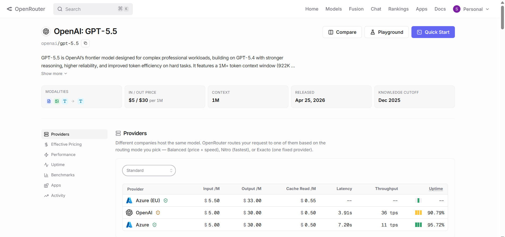
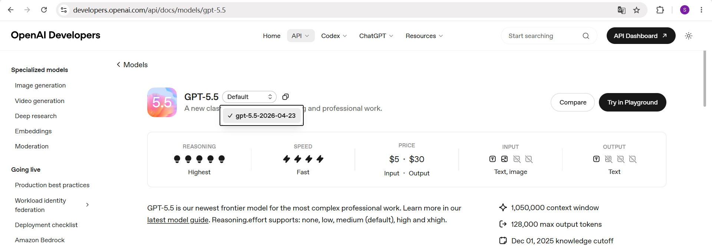

# Search Codegen Demo

从 `week1/search-codegen` 抽取的**独立精简工程**，固定问题、无命令行交互，直接运行 OpenRouter + GPT-5 联网推理示例。

## 任务

> 东盟 10 国首都之间，距离最近的两个首都是？给出你的详细分析推理过程。

## 运行

```bash
cd week1/search-codegen-demo
pip install -r requirements.txt
cp env.example .env   # 填入 OPENROUTER_API_KEY
python main.py
```

配置见 `env.example`（`OPENROUTER_API_KEY`、`MODEL_NAME`、`REASONING_EFFORT` 等）。

## 与 search-codegen 的区别

| 项目 | 说明 |
|------|------|
| `search-codegen` | 完整版，交互式 CLI、`argparse`、测试脚本 |
| `search-codegen-demo` | 精简版，固定单题，`python main.py` 直接跑 |

## 技术要点

- **API**：OpenRouter `POST /chat/completions`
- **联网**：OpenRouter `plugins: [{ "id": "web" }]`（非 Kimi 的 `$web_search`）
- **推理**：`reasoning.effort` 默认 **`medium`**（可通过 `REASONING_EFFORT` 覆盖）
- **Token 上限**：`DEFAULT_MAX_TOKENS` 默认 `16000`（medium 推理 + 联网任务较耗 token，4000 可能截断）
- **模型**：默认 `openai/gpt-5-2025-08-07`

更多背景见 `week1/search-codegen/NOTE.md`（OpenRouter 与 GPT-5 原生工具格式的差异）。

## OpenRouter：Model Routing vs Provider Routing

本工程通过 OpenRouter 调用模型（如 `openai/gpt-5-2025-08-07`）。OpenRouter 里最容易误解的一点是：**「模型」和「真正执行计算的节点」不是同一层概念**。

### 为什么一个模型下面有多个 Provider？

在 OpenRouter 页面中，同一个逻辑模型（例如 **OpenAI: GPT-5.5**）下列出多个 Provider（OpenAI、Azure、Azure EU 等）：



含义是：

> **同一个模型名，可以由多个不同算力提供商托管运行**——它们是同一模型能力的不同托管节点（hosted instances），而不是三个不同的模型。

### 两层路由

OpenRouter 实际是两层路由：

```text
第 1 层：模型路由（Model Routing）
  你填写 model: "openai/gpt-5.5"
  → 表示「我要用 GPT-5.5 这一能力族」

第 2 层：提供商路由（Provider Routing）
  OpenRouter 再决定请求交给谁执行
  → OpenAI 官方节点 / Azure OpenAI / Azure EU 等
```

```text
同一个模型抽象（openai/gpt-5.5）
        ↓
多个运行节点（multi-host inference layer）
        ↓
OpenRouter 动态选择 Provider
```

### 默认会用哪个 Provider？

**不额外配置时**，OpenRouter 不会固定某一个 Provider，而是每次请求可能不同。流程大致为：

1. **过滤**：是否可用、是否超时、是否限流、是否支持当前参数
2. **排序**：按路由模式在成本、延迟、稳定性之间权衡（如 Balanced / Nitro / Exacto）

可理解为：**动态竞价 + 健康检查 + 负载均衡**——不保证永远走 OpenAI 官方，也不保证永远走 Azure。

若要**固定 Provider**，需在请求中显式指定，例如：

```json
{
  "model": "openai/gpt-5.5",
  "provider": {
    "order": ["openai"],
    "allow_fallbacks": false
  }
}
```

这样才会始终使用 `openai` 节点，且不允许 fallback 到其他 Provider。

### 为何同一 Model 挂多个 Provider？

| 原因 | 说明 |
|------|------|
| 成本 | OpenAI 原生与 Azure 托管价格可能不同 |
| 区域 | EU 节点满足数据合规，US 节点延迟可能更低 |
| 稳定性 | 某 Provider 故障时可切换 |
| 吞吐 | 不同节点延迟、TPS、可用率不同 |

### 与 OpenAI 官网 Model ID 的区别

OpenAI 开发者文档中的模型 ID（如 `gpt-5.5-2026-04-23`）是**官方模型版本快照**：



| 系统 | `model` 含义 | Provider 概念 |
|------|-------------|---------------|
| **OpenAI 官网** | 固定版本（如 `gpt-5.5-2026-04-23`） | 不存在，一个模型对应官方部署 |
| **OpenRouter** | 逻辑模型（如 `openai/gpt-5.5`） | 存在，多节点可选、可路由 |

**一句话**：OpenRouter 的「模型」是**抽象能力**；**Provider 才是真正执行推理的算力池**。本 demo 的 `MODEL_NAME` 走的是 OpenRouter 逻辑模型名；实际命中哪个 Provider 由 OpenRouter 路由决定，响应里的 `provider_name` 可用来核对（详见 `week1/search-codegen/NOTE.md` 中关于 Azure 与工具能力的讨论）。

## OpenRouter 请求体说明

`agent.py` 中 `process_request` 会向 `POST /chat/completions` 发送如下结构的 `request_body`（首轮示例）：

```json
{
  "background": false,
  "max_tokens": 16000,
  "messages": [
    {
      "role": "system",
      "content": "You are an advanced AI assistant with web search and reasoning capabilities.\n..."
    },
    {
      "role": "user",
      "content": "东盟 10 国首都之间，距离最近的两个首都是？给出你的详细分析推理过程。"
    }
  ],
  "model": "openai/gpt-5-2025-08-07",
  "plugins": [
    { "id": "web", "max_results": 5 }
  ],
  "reasoning": {
    "effort": "medium",
    "generate_summary": false
  },
  "stream": false,
  "temperature": 0.3
}
```

### 顶层字段

| 字段 | 本工程取值 | 含义 |
|------|-----------|------|
| `model` | `openai/gpt-5-2025-08-07` | OpenRouter **逻辑模型 ID**（见上文 Model / Provider 路由）；非 OpenAI 官网的固定快照 ID |
| `messages` | system + user | 对话历史，Chat API 的核心输入 |
| `plugins` | `[{ "id": "web", "max_results": 5 }]` | 启用 OpenRouter 联网搜索插件 |
| `reasoning` | `{ "effort": "medium", "generate_summary": false }` | GPT-5 推理模型专用配置 |
| `stream` | `false` | 非流式，等待完整响应一次返回 |
| `temperature` | `0.3` | 采样温度，越低输出越稳定 |
| `max_tokens` | `16000` | 本次回复（推理 + 正文）的 token 上限 |
| `background` | `false` | 同步请求，非后台异步任务 |

### `messages`

| 消息 | `role` | 来源 | 作用 |
|------|--------|------|------|
| 系统提示 | `system` | `agent.py` → `_create_system_prompt()` | 定义 Agent 角色：何时搜索、展示推理、引用来源 |
| 用户问题 | `user` | `main.py` → `TASK` | 本次要回答的任务 |

多轮对话时还会追加 `assistant`、`user` 等；本 demo 首轮仅上述两条。

### `plugins`（联网搜索）

```json
"plugins": [{ "id": "web", "max_results": 5 }]
```

- OpenRouter 的**插件机制**，不是 Kimi 的 `builtin_function` + `$web_search`
- `id: "web"`：启用联网；模型需要查资料时由 OpenRouter 代为搜索
- `max_results`：每次搜索最多返回的结果条数（来自 `WEB_SEARCH_MAX_RESULTS`）
- 仅当 `use_tools=True` 时由 `_build_openrouter_request` 加入

### `reasoning`（推理配置）

| 子字段 | 含义 |
|--------|------|
| `effort` | 推理强度：`low` / `medium` / `high` |
| `generate_summary` | `false` 表示不单独生成推理摘要，只要最终 `content` |

### 其他字段

- **`stream: false`**：一次性返回完整 JSON；`true` 则为 SSE 流式输出
- **`temperature: 0.3`**：偏保守，适合地理、距离等事实类问题
- **`max_tokens: 16000`**：含推理 token 与最终正文；过小会导致截断
- **`background: false`**：HTTP 连接保持到请求完成

### 请求体如何组装

```text
_build_openrouter_request()     →  model, messages, stream, reasoning, background, plugins
process_request() 第 85–87 行  →  + temperature, max_tokens
```

一次请求的语义串联：

```text
用 GPT-5（model）
读 system + user（messages）
开启联网（plugins.web）
以 medium 强度先推理（reasoning.effort）
再以较低随机性写答案（temperature）
总输出不超过 16000 tokens（max_tokens）
非流式、同步返回（stream=false, background=false）
```

## 与 web-search-demo 的对比

| 项目 | 联网方式 | 推理配置 |
|------|----------|----------|
| `web-search-demo` | Kimi `builtin_function` + `$web_search` | 无 `reasoning` 字段 |
| `search-codegen-demo` | OpenRouter `plugins: [{ "id": "web" }]` | `reasoning.effort`（默认 `medium`） |
