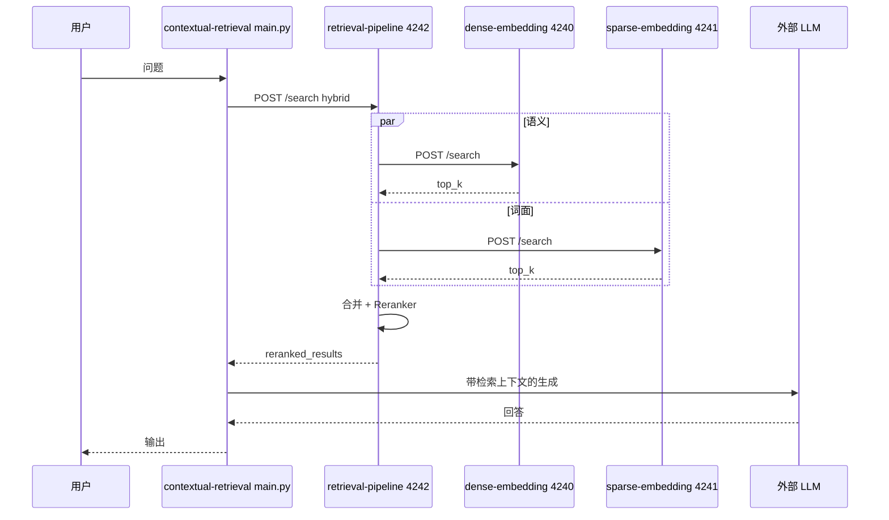

# Contextual Retrieval 与检索栈架构

本文说明 `contextual-retrieval` 与 `dense-embedding`、`sparse-embedding`、`retrieval-pipeline` 四个目录所对应进程的职责、端口依赖与一次「建索引 → 问答」的数据流。运行时的完整控制台日志可参考同目录下的 `index_local_laws_contextual.md`。

## 1. 进程与端口一览

| 目录 | 启动命令（示例） | 端口 | 职责摘要 |
|------|------------------|------|----------|
| `week3/dense-embedding` | `python main.py` | **4240** | BGE-M3 稠密向量编码 + HNSW 语义检索 |
| `week3/sparse-embedding` | `python server.py` | **4241** | BM25 + 倒排索引，词面检索 |
| `week3/retrieval-pipeline` | `python main.py` | **4242** | 编排 4240/4241；本地 DocumentStore；BGE-Reranker 重排 |
| `week3/contextual-retrieval` | 无常驻 HTTP 服务 | — | 建索引脚本 + `main.py` 交互式 RAG（调 4242 + 外部 LLM） |

**外部 LLM（如 Kimi）**：用于（1）建索引时为每个 chunk 生成上下文描述；（2）问答时根据检索结果生成回答。密钥见本目录 `.env`（`MOONSHOT_API_KEY` 等），由 `config.py` 在导入时加载。

## 2. 依赖关系（4242 为枢纽）

4242 在索引与检索时通过 HTTP 调用 4240、4241；向量化与 BM25 的实现分别在各自进程中。重排模型运行在 **retrieval-pipeline** 进程内，不单独占端口。

```
                    ┌─────────────────────────────┐
                    │  contextual-retrieval      │
                    │  index_local_laws_*.py      │
                    │  main.py (RAG 客户端)       │
                    └──────────────┬──────────────┘
                                   │ HTTP
                                   │ localhost:4242
                                   ▼
                    ┌─────────────────────────────┐
                    │  retrieval-pipeline :4242   │
                    │  DocumentStore + Reranker   │
                    └───────┬─────────────┬──────┘
                            │             │
              POST /index   │             │   POST /index
              POST /search  │             │
                            ▼             ▼
              ┌─────────────────┐   ┌─────────────────┐
              │ dense-embedding │   │ sparse-embedding│
              │ :4240           │   │ :4241           │
              │ 向量 + HNSW     │   │ BM25 倒排       │
              └─────────────────┘   └─────────────────┘
```

## 3. 推荐启动顺序

1. **4240**：`cd week3/dense-embedding && python main.py`（首次会拉取 BGE-M3，耗时较长）
2. **4241**：`cd week3/sparse-embedding && python server.py`
3. **4242**：`cd week3/retrieval-pipeline && python main.py`（依赖 4240、4241 可达；本进程加载 Reranker）
4. **本目录**：配置 `.env` 后执行 `python index_local_laws_contextual.py`，再 `python main.py` 做交互问答

快速步骤仍见 `notes.md`。

## 4. 建索引数据流（index_local_laws_contextual.py）

1. 从磁盘读取法规 Markdown（默认指向 `../agentic-rag/laws`，可用 `--laws-dir` 覆盖）。
2. 分块；若未使用 `--no-contextual`，则对每个 chunk 调用 **LLM** 生成简短上下文，并与原文拼接为 `contextualized_text`。
3. 对每个待索引块向 **`http://localhost:4242/index`** 发送请求（正文一般为带上下文的文本，metadata 中可含 `original_text`、`contextual` 等）。
4. **4242** 将文档写入本地 `DocumentStore`，并**并行**请求：
   - **4240** `/index`：编码向量并更新 HNSW；
   - **4241** `/index`：更新 BM25 倒排。

因此你在 `index_local_laws_contextual.md` 中会看到同一时段 4240 的多次 `encode` 与 4241 的 `External doc_id` 索引日志，来源均为本机到 4242 的转发。

## 5. 问答数据流（main.py）

1. 用户输入问题（如「宪法第四条是什么」）。
2. `KnowledgeBaseType.LOCAL` 时，工具层向 **`http://localhost:4242/search`** 发起检索（默认多为 hybrid：稠密 + 稀疏）。
3. **4242** 内 `RetrievalClient` 按模式调用 4240/4241 的 `/search`，合并候选后由 **BGE-Reranker** 重排，返回 `reranked_results` 及片段文本。
4. **AgenticRAG** 将检索结果作为上下文，再调 **LLM** 生成最终回答。



## 6. 配置要点

- **4242 下游地址**：`retrieval-pipeline/config.py` 中默认 `http://localhost:4240` 与 `http://localhost:4241`，可通过环境变量 `DENSE_SERVICE_URL`、`SPARSE_SERVICE_URL` 修改。
- **本仓库 RAG 指向的管道**：`contextual-retrieval/config.py` 中 `KnowledgeBaseConfig.local_base_url` 默认 `http://localhost:4242`。
- **法规目录**：`index_local_laws_contextual.py` 默认 `../agentic-rag/laws`，与 `notes.md` 中的建索引步骤一致。

## 7. 与 `index_local_laws_contextual.md` 的分工

| 文档 | 内容定位 |
|------|----------|
| **ARCHITECTURE.md**（本文） | 概念结构、依赖、数据流、配置入口 |
| **index_local_laws_contextual.md** | 各服务在同一轮操作下的原始日志摘录，便于对照时间线与请求顺序 |
| **notes.md** | 最短操作清单 |

若只关心「先起哪几个服务、再跑哪两个脚本」，以 `notes.md` 为准；若需理解「为何 4240 与 4241 会同时出现索引日志」，以本文第 4 节为准。
