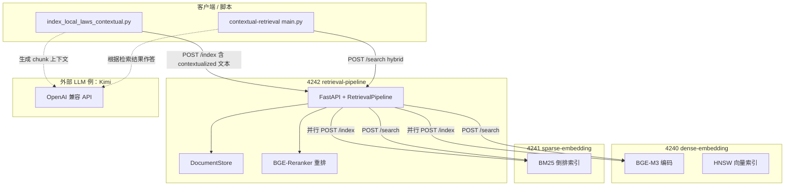
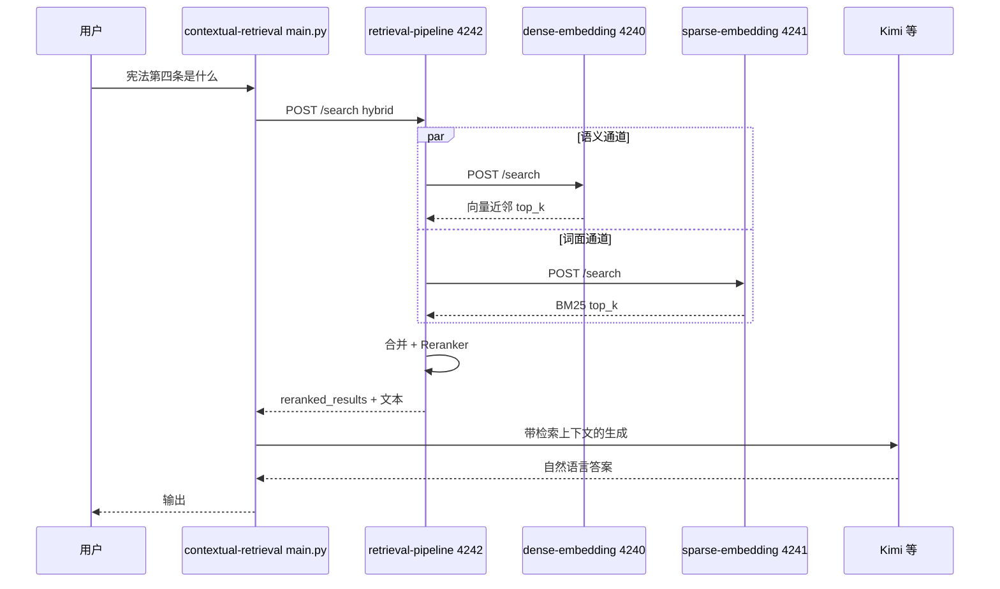

# 演示
1. 安装依赖：`pip install -r requirements.txt`
2. 跑程序建索引：`python index_local_laws_contextual.py`
3. 跑程序检索记忆：`python main.py`
    - 输入问题1：`宪法第四条是什么`
# 理解
已结合 `index_local_laws_contextual.md` 里的日志与各仓库代码，可以把整条链路理解如下。

## 总体角色（四个进程 + 两类「大脑」）

| 组件 | 端口 | 职责 |
|------|------|------|
| **dense-embedding** | 4240 | 用 **BGE-M3** 把文本编成向量，在 **HNSW** 里做**语义**相似检索。 |
| **sparse-embedding** | 4241 | **BM25 + 倒排索引**，做**词面/关键词**检索。 |
| **retrieval-pipeline** | 4242 | **编排层**：索引时并行写 4240/4241；检索时按模式拉 dense/sparse/混合，再在本进程内用 **BGE-Reranker** 重排；并维护本地 `DocumentStore`。 |
| **contextual-retrieval** | 无常驻端口 | **建索引脚本**（读法规、可选 LLM 生成 chunk 上下文）+ **main.py 交互式 RAG**（再调 Kimi 等 LLM 组织答案）。 |

另外还有两处 **Kimi（或其它 LLM）**：  
- 建索引时：为每个 chunk 生成「上下文说明」（你文档里 sparse 日志里 `contextual: True` 的 metadata 即来自此）。  
- 问答时：`main.py` 里的 Agent 根据检索结果生成自然语言回答。

---

## 服务之间的依赖关系（4242 是枢纽）

4242 **不实现**向量化与 BM25，只通过 HTTP 调用 4240、4241；**重排模型**加载在 4242 进程里。

---

## 运行机制分两段：建索引 vs 提问

### 1）建索引（`index_local_laws_contextual.py`）

1. 从磁盘读法规（如 `agentic-rag/laws` 下按门类分文件夹的 `.md`）。  
2. **分块**；若开启 contextual，则对每个 chunk 调 **LLM** 生成简短上下文，拼成 `contextualized_text`（你文档里 sparse 日志里「宪法开篇…」+ 正文即此类）。  
3. 对每条 chunk 向 **`http://localhost:4242/index`** 发请求。  
4. **4242** 在本机存一份全文+metadata，并 **`asyncio` 并行**调用：  
   - **4240** `/index`：编码向量并写入 HNSW；  
   - **4241** `/index`：BM25 建倒排（索引的是送入的文本，含上下文前缀时稀疏通道也会利用这些词）。  

因此你在 `index_local_laws_contextual.md` 里会看到：同一时段 4240 多次 `encode`、4241 多次 `Indexing document with external ID '宪法_chunk_0'` 等，且来源 IP 指向本机，即 4242 在代你写两个下游服务。

### 2）提问（`python main.py`，例如「宪法第四条是什么」）

1. `AgenticRAG` / `KnowledgeBaseTools` 把知识库类型设为 **LOCAL** 时，会向 **`http://localhost:4242/search`** 发检索（默认多为 **hybrid**）。  
2. **4242** 的 `RetrievalClient` 按模式请求：  
   - **dense**：只问 4240；  
   - **sparse**：只问 4241；  
   - **hybrid**：两边都问，再在管道内 **合并候选**。  
3. **4242** 用 **BGE-Reranker** 对合并后的文档与 query 做交叉编码重排，得到最终 top-k。  
4. 检索结果回到 **contextual-retrieval**，再由 **LLM** 结合片段生成回答（并可能带引用/推理轨迹，取决于 agent 配置）。

---

## 和你文档的对应关系

`index_local_laws_contextual.md` 里按小节贴的 **4240 / 4241 / 4242 / contextual-retrieval** 日志，正是在印证：

- **4240**：每条被索引的 chunk 一次编码 + HNSW 更新；  
- **4241**：同一条 chunk 以 `doc_id`（如 `宪法_chunk_0`）写入 BM25，metadata 里带 `contextual`、`original_text` 等；  
- **4242**：承接索引与检索，内部再调上述两者并重排；  
- **contextual-retrieval**：负责「法规 → LLM 上下文增强 → 推送到 4242」以及「用户问题 → 4242 检索 → LLM 作答」这两段**业务编排**，本身不是第四个向量服务。

