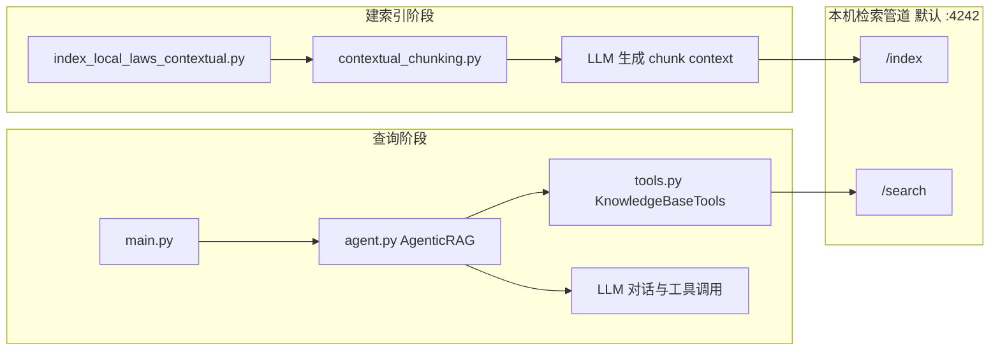

# 建索引阶段与查询阶段：端到端说明

本文把 **`python index_local_laws_contextual.py`（建索引）** 与 **`python main.py`（查询）** 在代码层面的调用关系串成一条线，便于对照源码阅读。

---

## 1. 总览：两套程序，一个检索服务

| 概念 | 说明 |
|------|------|
| **建索引** | 独立脚本 `index_local_laws_contextual.py`，**不经过** `AgenticRAG`。直接向本机检索管道发 `POST /index`。 |
| **查询** | `main.py` 启动交互（或单条 `--query`），构造 `AgenticRAG`，由 **LLM 智能体** 决定是否调用工具；工具内部发 `POST /search`。 |
| **共同点** | 二者都依赖 **同一套本机检索管道**（默认 `http://localhost:4242`）：`/index` 写入、`/search` 读取同一索引空间（向量 + 稀疏等由管道内部再分发给子服务，详见 `notes.md`）。 |

**结论**：`/index` 与 `/search` 是**同一检索服务上的两个 HTTP 接口**；**「带工具的 Agent」只出现在查询阶段**，建索引阶段没有 `agent.py` 里的 ReAct 循环。

---

## 2. 运行前准备

1. **检索管道已启动**  
   `main.py` 的 `setup_environment()` 会尝试访问 `{local_base_url}/health`。管道未启动时，`/search` 会失败或返回空。  
   默认 `local_base_url` 见 `config.py` 中 `KnowledgeBaseConfig.local_base_url`（一般为 `http://localhost:4242`）。

2. **索引脚本与查询共用 URL（建议一致）**  
   - 查询侧：`Config.from_env()` → `KnowledgeBaseConfig.local_base_url`。  
   - 索引侧：`index_local_laws_contextual.py` 中 `RETRIEVAL_PIPELINE_URL` 或命令行 `--pipeline-url`。  
   若二者不一致，会出现「索引写进 A 服务、查询却问 B 服务」的现象。

3. **工作目录与 `document_store.json`**  
   `KnowledgeBaseConfig.document_store_path` 默认为相对路径 `document_store.json`。  
   索引脚本在**当前工作目录**下写入/更新该文件；`main.py` 启动时 `KnowledgeBaseTools` 也从该路径加载。  
   **建议在 `week3/contextual-retrieval` 目录下**分别执行两条命令，避免路径错位。

4. **环境变量**  
   - 建索引（上下文感知）：需为 `ContextualChunker` 配置可用的 LLM（如 `MOONSHOT_API_KEY` 等，见 `LLMConfig`）。  
   - 查询：同样需要 LLM；LOCAL 检索不替代 LLM 生成最终回答。

---

## 3. 建索引阶段：`index_local_laws_contextual.py`

### 3.1 入口

- 脚本末尾 `main()`：`argparse` 解析参数后构造 `ContextualLegalIndexer`，调用 **`process_all_documents(...)`**。

### 3.2 主流程（按执行顺序）

1. **`cleanup_existing_index()`**（默认执行，可用 `--no-cleanup` 跳过）  
   - 删除本地 `document_store.json`（若存在）。  
   - 尝试 `DELETE {pipeline_url}/clear` 清空管道索引。

2. **`get_all_legal_documents()`**  
   - 默认扫描 `../agentic-rag/laws` 下按**门类子目录**组织的 `*.md`（可用 `--laws-dir` 覆盖）。

3. **对每个文档**  
   - **`read_document`**：读入全文。  
   - **`process_document`**：  
     - **`generate_document_id`**：由文件名得到逻辑 `doc_id`（如 `宪法`）。  
     - **`ContextualChunker.chunk_document`**（`contextual_chunking.py`）：  
       - 先做基础分块（段落边界等，配置见脚本内 `LEGAL_CHUNKING_CONFIG`）。  
       - 若开启 contextual：对每个块调 LLM 生成 `context`，拼出 **`contextualized_text`**。  
     - 若 `index_immediately=True`：通过 **`on_chunk_ready` 回调**，每生成一块就调用 **`index_chunk`**。

4. **`index_chunk`（核心：写入检索管道）**  
   - 组装 JSON：`text` 为 **`contextualized_text`**（或纯 `chunk.text`），**`doc_id` 为 `chunk.chunk_id`**（例如 `宪法_chunk_0`）。  
   - `POST {pipeline_url}/index`。  
   - 成功则 **`save_chunk_to_document_store`**：以 `chunk.chunk_id` 为键，把该块内容写入 **`document_store.json`**，供查询侧 `get_document` 优先命中内存/文件（见下节）。

5. **`save_document_info`**  
   - 在 `document_store.json` 里再写一条**文档级摘要**（键为逻辑 `doc_id` 如 `宪法`），`metadata.chunk_ids` 列出该文档所有块 id，便于整体了解。

### 3.3 建索引阶段「不会」发生的事

- **不会**创建 `AgenticRAG`（`agent.py`）。  
- **不会**调用 `knowledge_base_search` 或 `tools.py` 里的 `_search_local`（除非你在脚本里单独跑 `--compare` 等自检逻辑，那是额外的 `POST /search` 测试）。

---

## 4. 查询阶段：`main.py` + `agent.py` + `tools.py`

### 4.1 入口

- **`main()`**：`Config.from_env()` → **`AgenticRAG(config)`**。  
- 无 `--query` / `--batch` 时进入 **`run_interactive_mode`**；默认 **`agent.query(user_input, stream=True)`**（agentic 模式）。

### 4.2 Agentic 模式主流程（默认）

1. **`AgenticRAG.query`**（`agent.py`）  
   - 组装 system prompt（要求基于知识库、引用、可多轮工具等）。  
   - **while 循环**（最多 `AgentConfig.max_iterations` 次）：  
     - `chat.completions.create(..., tools=get_tool_definitions(), tool_choice="auto")`。  
     - 若返回 **`tool_calls`**：  
       - **`_execute_tool`**：  
         - `knowledge_base_search` → **`KnowledgeBaseTools.knowledge_base_search`**（`tools.py`）。  
         - `get_document` → **`get_document`**（可先查内存 `document_store`，LOCAL 时再 **`GET .../documents/{doc_id}`**）。  
       - 将工具结果以 `role: tool` 写回 `messages`，**继续下一轮**。  
     - 若无 `tool_calls`：将助手回复写入对话历史，作为**最终答案**返回（流式时经 `_stream_response` 按字符吐出）。

2. **`knowledge_base_search` → `_search_local`（LOCAL）**  
   - `POST {local_base_url}/search`，JSON 大致为：  
     - `query`：由模型在工具参数里给出（可与用户原句相同或改写）。  
     - `mode`: `"hybrid"`。  
     - `top_k`: **`KnowledgeBaseConfig.local_top_k`**（默认 **3**，可在配置/环境中修改）。  
     - `rerank`: `true`。  
   - 解析响应：优先 **`reranked_results`**，否则回退 `results` / `dense_results` / `sparse_results`。  
   - 每条结果映射为 `doc_id`、`chunk_id`、`text`、`score` 等，供模型在下一轮阅读。

3. **Non-agentic 模式（可选）**  
   - **`query_non_agentic`**：直接用**用户原句**调用一次 **`knowledge_base_search`**，取前若干条拼进 prompt，再单次调用 LLM，**无工具循环**。

### 4.3 查询阶段与建索引的衔接

| 建索引写入 | 查询时消费 |
|------------|------------|
| `POST /index`，`doc_id = chunk.chunk_id` | `/search` 返回的 `doc_id` 与索引侧一致，标识**分块**而非整部书文件名。 |
| `text ≈ contextualized_text` | 检索与重排主要基于该字符串；metadata 中常带 `original_text`。 |
| `document_store.json` 按 `chunk_id` 存块 | `get_document(doc_id)` 若键存在，直接返回本地内容；否则走 **`/documents/{doc_id}`**。 |

因此：用户问「宪法最后一条是什么」时，能否答对，取决于 **hybrid + rerank 后的 top_k 块里是否包含含最后一条文的分块**；这不是按「文档物理末尾」取数，而是**近似检索**（详见仓库内 `chunking-final-chunk-min-size.md` 等与分块相关的说明）。

---

## 5. 配置对照速查

| 配置项 | 作用 | 典型位置 |
|--------|------|----------|
| `KnowledgeBaseType.LOCAL` | 查询走 `_search_local` | `config.py` / 环境变量覆盖 |
| `local_base_url` | `/search`、`/documents` 的根 URL | `config.py`，须与索引 `--pipeline-url` 一致 |
| `local_top_k` | 每次检索请求条数 | `config.py`，默认 3 |
| `document_store_path` | 本地块缓存路径 | `config.py`，默认 `document_store.json` |
| `LEGAL_CHUNKING_CONFIG` | 法规分块软/硬上限、重叠、`min_chunk_size` 等 | `index_local_laws_contextual.py` |

---

## 6. 相关文档与源码文件

- **分块与上下文感知细节**：`docs/main.md`、`contextual_chunking.py`。  
- **检索管道端口与 4240/4241/4242 分工**：`docs/notes.md`。  
- **索引脚本参数与运维**：`docs/index_local_laws_contextual.md`。  
- **尾块与 `min_chunk_size` 行为**：`docs/chunking-final-chunk-min-size.md`。

---

*文档与仓库源码同步维护；若接口字段名或默认端口变更，请以实际代码与检索管道实现为准。*
