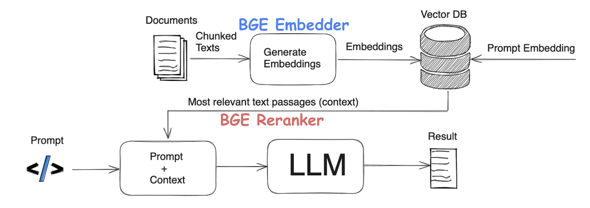

# BGE 在 RAG 中的作用说明文档

## 1. 文档背景

在基于大语言模型（LLM, Large Language Model）的知识问答场景中，仅依赖模型自身参数进行回答，容易出现以下问题：

- 无法掌握企业内部知识
- 对专业领域知识理解有限
- 容易产生“幻觉”（Hallucination）
- 回答缺乏依据与可追溯性

因此，越来越多的系统采用 **RAG（Retrieval-Augmented Generation，检索增强生成）** 架构，通过“先检索知识，再生成回答”的方式提升回答质量。

BGE（BAAI General Embedding）是面向搜索与 RAG 场景的一套一站式检索工具包，提供：

- Embedding（向量化）
- Reranker（重排序）
- Evaluation（检索评估）
- Fine-tuning（微调）

本文基于典型 RAG 架构，对 BGE 在其中的作用进行说明。

---

## 2. RAG 架构整体说明
   

RAG（Retrieval-Augmented Generation）是一种：


> **通过知识检索增强大模型回答能力的技术架构。**

其核心思想是：

> **先从知识库中找到与问题最相关的信息，再将这些信息作为上下文交给大模型生成答案。**

整体流程如下：

```text
原始文档
    ↓
文本切块（Chunk）
    ↓
Embedding 向量化
    ↓
向量数据库（Vector DB）

用户提问
    ↓
问题向量化
    ↓
向量检索（Recall）
    ↓
Reranker 重排序
    ↓
Prompt + Context
    ↓
LLM 生成答案
````

在整个过程中，BGE 主要承担：

* **Embedding（向量生成）**
* **Reranker（结果重排序）**

两个核心职责。

---

## 3. 整体架构说明

如下图所示：

### 3.1 离线建库流程

离线阶段主要负责：

> **将企业知识转化为可检索的数据结构。**

流程包括：

```text
Documents
    ↓
Chunked Texts
    ↓
BGE Embedder
    ↓
Embeddings
    ↓
Vector DB
```

### 3.2 在线问答流程

在线阶段主要负责：

> **根据用户问题检索最相关知识并生成回答。**

流程包括：

```text
Prompt
    ↓
Prompt Embedding
    ↓
Vector DB 检索
    ↓
Most Relevant Context
    ↓
BGE Reranker
    ↓
Prompt + Context
    ↓
LLM
    ↓
Result
```

---

# 4. 离线建库阶段

## 4.1 Documents（原始文档）

知识来源通常是企业已有资料，例如：

* 管理制度
* 技术规范
* 项目文档
* 会议纪要
* Excel 报表
* PDF 文件
* Word 文档

例如：

```text
《设备管理制度》
《危大工程管理办法》
《集中采购实施细则》
《项目履约管理办法》
```

这些文档构成企业知识库的原始数据。

但原始文档通常篇幅较长，无法直接用于检索。

因此，需要进行文本切分。

---

## 4.2 Chunked Texts（文本切块）

### 为什么需要切块？

大模型和检索系统无法高效处理超长文档，因此需要将文档拆分为多个小段（Chunk）。

例如：

一个 100 页制度文件：

```text
《施工安全管理办法》
```

可能被拆分为多个片段：

### Chunk 1

```text
进入施工现场前，必须完成安全教育培训。
```

### Chunk 2

```text
特种设备操作人员应持证上岗。
```

### Chunk 3

```text
危大工程应编制专项施工方案。
```

### Chunk 设计原则

通常考虑：

* 固定长度切块
* 语义切块
* 段落切块
* 重叠窗口（Overlap）

例如：

```text
chunk_size = 512
overlap = 100
```

其目的是：

> **保证检索精度和上下文完整性。**

---

## 4.3 BGE Embedder（向量生成）

文本切块后，需要进行：

> **Embedding（语义向量化）**

其核心作用是：

> **将文本转换为机器可理解的语义向量。**

例如：

文本：

```text
机械设备验收流程
```

经过 BGE Embedding 模型处理后：

```text
[0.182, -0.337, 0.724, ...]
```

变成一组高维向量。

### 为什么要向量化？

因为传统关键词搜索存在局限：

例如：

问题：

```text
设备验收要求
```

文档：

```text
机械设备进场流程
```

虽然关键词不同，但语义相近。

Embedding 能够识别：

> **语义相似，而不仅仅是词语一致。**

因此：

> **Embedding 的本质是语义理解。**

### BGE Embedder 的职责

在 RAG 中：

> **负责粗粒度召回（Recall）。**

即：

> **先尽可能找出“可能相关”的内容。**

而不是一次就找最准的内容。

---

## 4.4 Vector DB（向量数据库）

Embedding 后的数据进入：

> **向量数据库（Vector Database）**

存储内容包括：

```text
文本片段 + embedding 向量
```

例如：

| 文本片段      | 向量          |
| --------- | ----------- |
| 危大工程需专项方案 | [0.2,0.8,…] |
| 起重设备验收流程  | [0.3,0.5,…] |

常见向量数据库：

* Milvus
* pgvector
* Qdrant
* Elasticsearch Vector
* FAISS
* Chroma

向量数据库支持：

> **语义相似度搜索（Similarity Search）**

而不是普通 SQL 查询。

---

# 5. 在线问答阶段

## 5.1 用户输入 Prompt

用户提出问题，例如：

```text
危大工程什么时候需要专家论证？
```

此时：

> 系统不能直接交给 LLM 回答。

因为：

LLM 可能：

* 回答错误
* 编造内容
* 缺乏企业依据

因此：

先进行知识检索。

---

## 5.2 Prompt Embedding（问题向量化）

用户问题同样需要：

> 向量化

即：

```text
用户问题 → Embedding 向量
```

例如：

```text
[0.215, 0.821, ...]
```

注意：

这里通常要求：

> **问题与文档使用同一个 Embedding 模型。**

保证向量空间一致。

---

## 5.3 Recall（召回）

系统将：

> 问题向量

到：

> Vector DB

中进行相似度检索。

例如：

检索 Top-K：

```text
Top1 危大工程专项方案规定
Top2 专家论证流程
Top3 安全施工制度
```

此阶段目标：

> **宁可多找，也不要漏掉。**

因此：

Recall 偏向：

> 高召回率。

但结果未必最准。

---

## 5.4 BGE Reranker（重排序）

这是 RAG 中非常关键的一步。

### 为什么需要 Reranker？

Embedding 检索属于：

> 粗筛

容易出现：

> “差不多相关，但不是最相关”

例如：

用户问题：

```text
危大工程什么时候专家论证？
```

召回结果：

```text
1. 危大工程施工要求
2. 专项方案审批流程
3. 超规模危大工程专家论证要求
```

真正最相关的是：

```text
超规模危大工程专家论证要求
```

但向量检索未必排第一。

因此：

需要：

> **Reranker（二次排序）**

---

### Reranker 工作机制

Reranker 会：

> **逐条比较：问题 + 文档**

并重新打分。

例如：

初始结果：

| 文档 | 分数   |
| -- | ---- |
| A  | 0.82 |
| B  | 0.81 |
| C  | 0.80 |

Reranker 后：

| 文档 | 分数   |
| -- | ---- |
| C  | 0.96 |
| A  | 0.89 |
| B  | 0.74 |

最终：

> 将最相关内容放到最前面。

### 作用

Reranker 的核心价值：

* 提高答案准确率
* 减少噪音上下文
* 提升知识命中率
* 降低模型幻觉

可以理解为：

| 模块       | 角色 |
| -------- | -- |
| Embedder | 初筛 |
| Reranker | 精排 |

---

## 5.5 Prompt + Context

经过检索与重排序后：

系统会将：

### 用户问题

与

### 最相关上下文

拼接成最终 Prompt。

例如：

```text
【参考资料】
1. 超规模危大工程应组织专家论证。
2. 专项施工方案需经审批。

【用户问题】
危大工程什么时候需要专家论证？
```

此时：

> LLM 不再“自由发挥”。

而是：

> **基于检索内容回答。**

---

## 5.6 LLM（大模型生成）

最后：

交给大模型生成自然语言结果。

例如：

```text
根据《危大工程管理办法》，超过一定规模的危大工程应组织专家论证。
```

此时：

回答具备：

### 1. 准确性

来源于知识库。

### 2. 可追溯性

有依据。

### 3. 专业性

基于企业领域知识。

### 4. 低幻觉

减少编造。

---

# 6. BGE 在 RAG 中的角色定位

BGE 提供的是：

> **一整套检索能力。**

其核心定位如下：

| 能力          | 作用   |
| ----------- | ---- |
| Embedding   | 语义召回 |
| Reranker    | 精准排序 |
| Evaluation  | 检索评估 |
| Fine-tuning | 行业微调 |

一句话总结：

> **BGE 负责“找资料”，LLM 负责“组织语言”。**

---

# 7. 企业场景示例（工程建设行业）

以工程建设企业为例。

企业知识来源：

```text
制度文件
施工规范
项目日报
会议纪要
供应链制度
危大工程管理办法
机械设备管理制度
```

项目经理提问：

```text
塔吊停机多久需要重新验收？
```

系统流程：

```text
问题输入
    ↓
BGE Embedding
    ↓
Vector DB 检索
    ↓
BGE Reranker 精排
    ↓
相关制度片段
    ↓
LLM 回答
```

最终输出：

```text
根据《机械设备管理制度》第 X 条，
塔吊停机超过 XX 天后，应重新进行安全验收。
```

同时可附带：

> 来源文档与条款依据。

这使得：

> 企业知识问答具备可信性和可落地性。

---

# 8. 总结

RAG 的核心思想是：

> **先检索，再生成。**

其中：

### BGE Embedder

负责：

> **将文本转为语义向量，实现知识召回。**

### BGE Reranker

负责：

> **对召回结果进行精排，提高上下文质量。**

### LLM

负责：

> **基于上下文生成自然语言答案。**

因此：

> **BGE + RAG + LLM 的组合，使大模型能够真正使用企业知识，而不是仅依赖模型自身记忆。**

```
