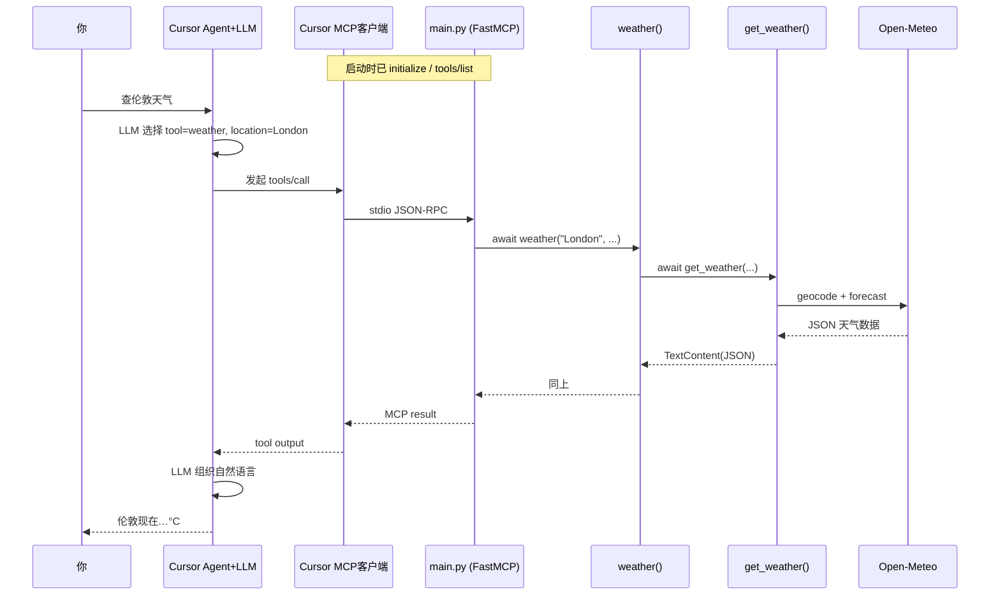

你想搞清楚的是整条链：**从 Cursor 里一句话，到 Python 里 `get_weather` 被真正执行**。下面按时间顺序拆开，并标出**你能看到的代码**和**Cursor 内部（闭源）**分别在哪一步。

---

## 总览：谁在哪一层

```
┌─────────────────────────────────────────────────────────────┐
│  Cursor（客户端，闭源）                                        │
│  · 聊天 UI、内置 LLM、MCP 客户端                                │
│  · 读 mcp.json → 拉起子进程 → stdio 发 JSON-RPC                 │
└───────────────────────────┬─────────────────────────────────┘
                            │ stdin/stdout（MCP 协议）
┌───────────────────────────▼─────────────────────────────────┐
│  你的仓库（开源，可调试）                                       │
│  src/main.py  →  weather()  →  get_weather()  →  Open-Meteo   │
└─────────────────────────────────────────────────────────────┘
```

**PyCharm 能单步跟的**：主要是下面 **`main.py` → `get_weather`** 这一段。  
**Cursor 里 LLM 怎么选工具**：逻辑在 Cursor 内部，只能通过 Tool call 日志观察，一般进不了 PyCharm。

---

## 完整流程（以「查伦敦天气」为例）

### 阶段 0：启动 MCP（你打开开关时，不是每次提问都做一次）

1. Cursor 读 `mcp.json`，执行类似：
   ```text
   .venv/Scripts/python.exe  .../src/main.py
   ```
2. 进入 `main.py` 底部：

```619:621:e:\ai&ai agent\github\ai-agent-book-projects\week4\perception-tools\src\main.py
if __name__ == "__main__":
    logging.info("Starting Perception Tools MCP server!")
    mcp.run(transport="stdio")
```

3. `FastMCP` 在 **stdin/stdout** 上等待 MCP 消息（不是等人打字聊天）。
4. 启动时 Cursor 会发 **`initialize`**、**`tools/list`** 等；`@mcp.tool` 注册的函数（含 `weather`）会出现在工具列表里，并带上 `description` 给 LLM 看。

此时进程已起来，但 **`get_weather` 还没执行**。

---

### 阶段 1：你在 Cursor 输入「查伦敦天气」

| 步骤 | 发生位置 | 做什么 |
|------|----------|--------|
| 1.1 | Cursor Chat/Agent | 把你的话 + **可用 MCP 工具列表** 发给内置 LLM |
| 1.2 | LLM（Cursor 内） | 理解意图 → 决定调用工具名 **`weather`**，参数如 `location: "London"` |
| 1.3 | Cursor MCP 客户端 | 构造 MCP 请求 **`tools/call`**，经 **stdio** 写给 `main.py` 子进程 |

**这一步没有进你的 Python 仓库**，所以在 PyCharm 里看不到；对话里会出现 **Tool call: weather** 之类提示。

---

### 阶段 2：MCP Server 收到调用（你的代码开始执行）

| 步骤 | 文件 | 代码路径 |
|------|------|----------|
| 2.1 | `mcp` 库 + `main.py` | `mcp.run(stdio)` 读 stdin → 解析 JSON → 找到工具 `weather` |
| 2.2 | `main.py` | 调用你注册的包装函数：

```201:207:e:\ai&ai agent\github\ai-agent-book-projects\week4\perception-tools\src\main.py
@mcp.tool(description="Get current weather information for a location")
async def weather(
    location: str = Field(description="City name or coordinates"),
    units: str = Field(default="metric", description="Units (metric/imperial/standard)")
):
    """Get weather data."""
    return await get_weather(location, units)
```

| 2.3 | `main.py` 顶部 import | `from public_data_tools import get_weather`（第 20–22 行） |

**断点建议（Community 也能用）**：`weather()` 第一行、`get_weather()` 第一行。

---

### 阶段 3：`get_weather` 真正查天气

```24:131:e:\ai&ai agent\github\ai-agent-book-projects\week4\perception-tools\src\public_data_tools.py
async def get_weather(location: str, ...):
    logging.info(f"🌤️ Getting weather for: {location}")
    # 1) 地理编码：geocoding-api.open-meteo.com → London 经纬度
    # 2) 预报：api.open-meteo.com/v1/forecast → 温度、湿度等
    # 3) 组装 ActionResponse
    return TextContent(type="text", text=json.dumps(...))
```

执行顺序：

1. `requests.get` → Open-Meteo 地理编码（`name=London`）
2. `requests.get` → Open-Meteo 天气预报
3. 拼 `result` 字典（`temperature`、`description` 等）
4. 包成 `ActionResponse(success=True, message=result, ...)`
5. 返回 **`TextContent`**，正文是 **JSON 字符串**

---

### 阶段 4：结果沿原路返回

```
get_weather 返回 TextContent(JSON)
    → weather() 原样 return
    → FastMCP 写成 MCP tools/call 的 result
    → stdout → Cursor MCP 客户端
    → 作为 tool result 再喂给 LLM
    → LLM 生成自然语言：「伦敦现在 20°C，晴…」
    → 显示在 Cursor 对话框
```

你在对话里看到的是 **LLM 的总结**；MCP 实际拿到的是 **那段 JSON**。

---

## 时序图（便于对照调试）



---

## 和 `quickstart.py`（模式 A）的对比

| | 模式 A `quickstart.py` | 模式 B Cursor MCP |
|--|------------------------|-------------------|
| 谁决定调 `get_weather` | 代码写死 `await get_weather("London")` | **LLM** 选 `weather` |
| 谁调用 `weather()` | **不经过**，直接 `get_weather` | **经过** `main.py` 的 `@mcp.tool` |
| 通信方式 | 普通 Python 函数调用 | **stdio + MCP 协议** |
| 回复在哪 | 终端 print | **Cursor 对话框** |

**同一段业务逻辑**：最终都会进 `public_data_tools.get_weather`；MCP 多了一层 `main.weather` + 协议封装。

---

## 你想「跟路径」时，建议怎么调试

| 目标 | 做法 |
|------|------|
| 跟清 **`get_weather`、Open-Meteo、JSON 返回** | PyCharm Debug `quickstart.py` Test 4，或单独 `debug_weather.py` |
| 确认 **MCP 是否调到 `weather`** | Cursor 对话里看 Tool call；`main.py` 的 `weather()` 里加 `logging.info` |
| 单步 **`weather` → `get_weather`** | 在 `weather`、`get_weather` 下断点；用 quickstart 直接调 `get_weather` 只能跟后半段；要跟 `weather` 需 MCP 触发（Community 用日志更现实） |
| 跟 **LLM 为何选 weather** | 只能看 Cursor 的 tool 名称/参数，代码不在本仓库 |

**执着 Cursor + PyCharm 的原因**可以理解：你想跟 **整条链**。实际上：

- **后半段（MCP Server → get_weather）**：本仓库代码，PyCharm + 日志 + quickstart 能搞清。  
- **前半段（用户话 → LLM → tools/call）**：在 Cursor 里，用 **Agent 的 Tool call 面板 + MCP Output** 观察即可。

---

## 一张「代码文件」对照表

| 顺序 | 位置 | 作用 |
|------|------|------|
| ① | `mcp.json` | 告诉 Cursor 如何启动 `python .../main.py` |
| ② | `main.py`：`mcp.run(stdio)` | MCP 服务主循环 |
| ③ | `main.py`：`@mcp.tool` → `weather` | 对外的 MCP 工具名 + 参数 schema |
| ④ | `public_data_tools.py`：`get_weather` | 真正业务：HTTP 调 Open-Meteo |
| ⑤ | `base.py`：`ActionResponse` | 统一成功/失败 JSON 结构 |
| ⑥ | 返回 `TextContent` | MCP 把文本结果送回 Cursor |

